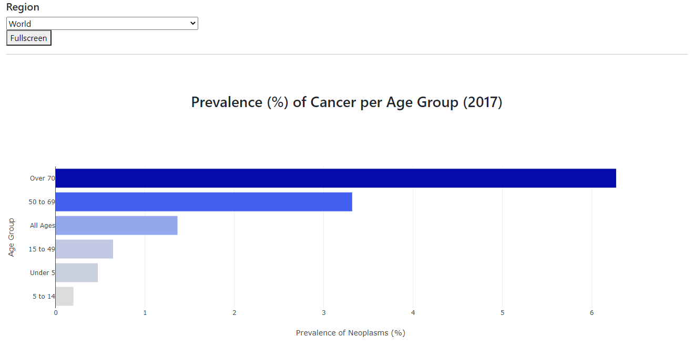
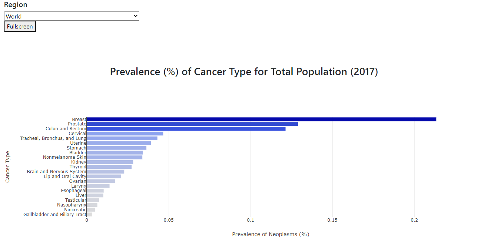
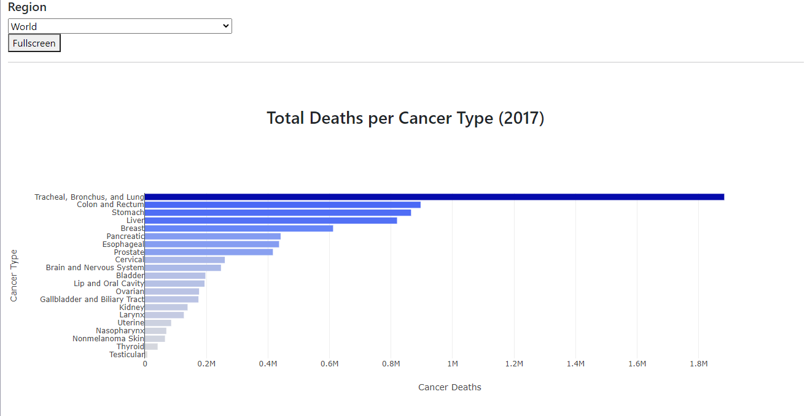

## Overview
An interactive visualizations dashboard that provides insights into global cancer statistics for 2017. Visitors to the site can view the entire dataset (World) or select a specific region to investigate. Phenomena examined include prevalence of cancer by age group, prevalence of cancer type for total populations, and total deaths by cancer type.

## Data
All data sets were extracted as CSVs from https://ourworldindata.org/cancer and were around 6500 rows in size.  

## Tools and Languages
- Backend development, database: PostgreSQL
- Web framework/workflow engine: Flask/SQLAlchemy
- Frontend devlopment: HTML/CSS, JavaScript

## Website
https://global-cancer-2017-analytics.herokuapp.com/

Made by Stephen Domke and Mona Peteet
